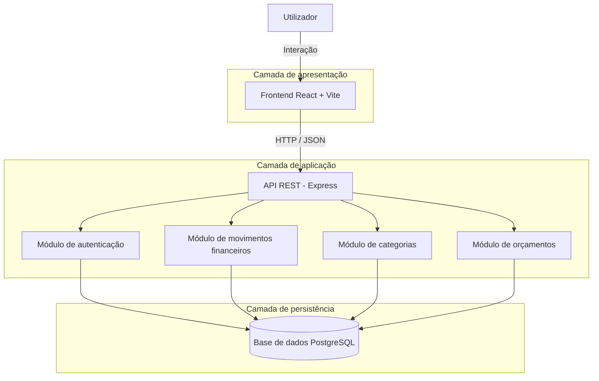

## Diagrama de arquitetura

```mermaid
flowchart TD
    USER["Utilizador"]

    subgraph FRONTEND["Camada de apresentação"]
        UI["Frontend React + Vite"]
    end

    subgraph BACKEND["Camada de aplicação"]
        API["API REST - Express"]
        AUTH["Módulo de autenticação"]
        TRANSACTIONS["Módulo de movimentos financeiros"]
        CATEGORIES["Módulo de categorias"]
        BUDGETS["Módulo de orçamentos"]
    end

    subgraph DATABASE["Camada de persistência"]
        DB[("Base de dados PostgreSQL")]
    end

    USER -->|"Interação"| UI
    UI -->|"HTTP / JSON"| API

    API --> AUTH
    API --> TRANSACTIONS
    API --> CATEGORIES
    API --> BUDGETS

    AUTH --> DB
    TRANSACTIONS --> DB
    CATEGORIES --> DB
    BUDGETS --> DB
```
